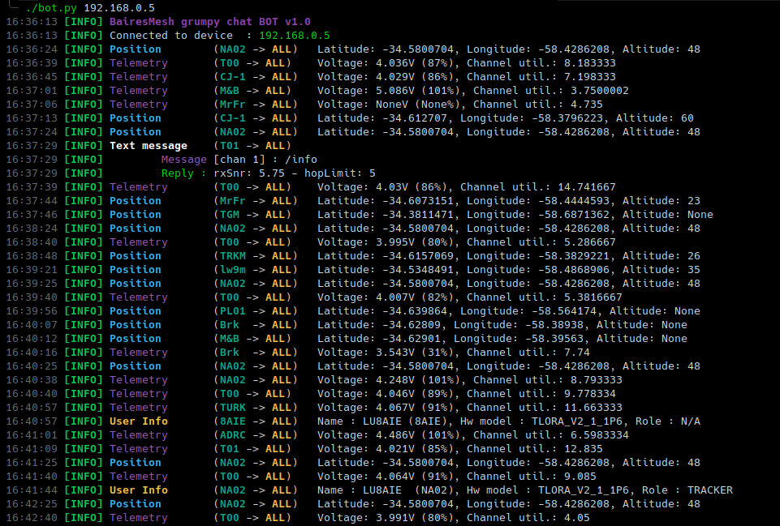

# Meshtastic Grumpy Bot

This is a simple bot using Meshtastic Python API to handle incoming messages and answering to some of them, sometimes providing useful information and some other times with bad mood.

## Usage

```sh
git clone git@github.com:smuniz/mesh_grumpy_bot.git
cd mesh_grumpy_bot
pip install -r requirements
./bot <device>
```

The parameter named *<device>* can either be an IPv4 address, a serial device (i.e. /dev/cu.xxx) or a BLE (Bluetooth Low Energy) UUID.




# Meshtastic Argentina

This project is part of Meshtastic Argentina users group!
Join us on Telegram at [Meshtastic Argentina group](https://t.me/meshtastic_argentina)

